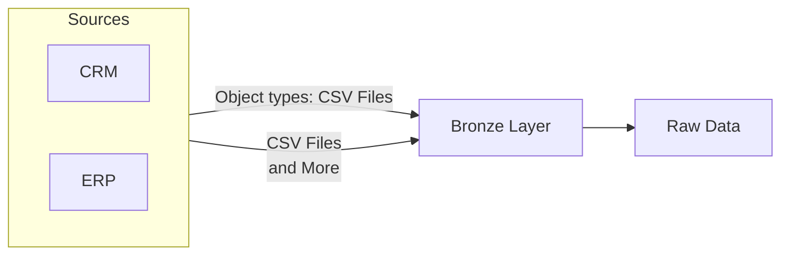

```mermaid
graph LR;
    subgraph A[Sources]
        direction LR
        CRM[CRM]
        ERP[ERP]
    end
    A -->|Object types: CSV Files | B[Bronze Layer];
    A -->|CSV Files\nand More| B[Bronze Layer];
    B --> C[Raw Data];
```
