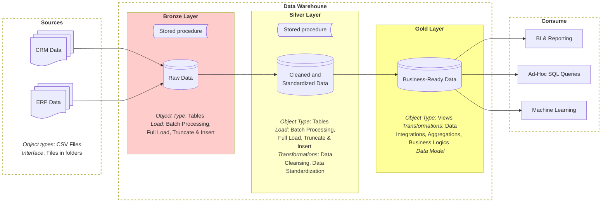

```mermaid
flowchart LR;
    subgraph LEVEL_SOURCES["<strong>Sources</strong>"]
        direction LR
        DATA_SOURCE_CRM@{ shape: docs, label: "CRM Data" }
        DATA_SOURCE_ERP@{ shape: docs, label: "ERP Data" }
        NOTE_SOURCES["<i>Object types</i>: CSV Files <br> <i>Interface</i>: Files in folders"]
    end

    subgraph LEVEL_DATAWAREHOUSE["<strong>Data Warehouse</strong>"]
        direction LR

        subgraph LAYER_BRONZE["<strong>Bronze Layer</strong>"]
            direction LR
            MISC_STORED_PROCEDURE_1@{ shape: bow-rect, label: "Stored procedure" }
            DATA_RAW@{ shape: lin-cyl, label: "Raw Data" }
            NOTE_BRONZE["<i>Object Type</i>: Tables <br> <i>Load</i>: Batch Processing, Full Load, Truncate & Insert"]
        end

        subgraph LAYER_SILVER["<strong>Silver Layer</strong>"]
            direction LR
            MISC_STORED_PROCEDURE_2@{ shape: bow-rect, label: "Stored procedure" }
            DATA_CLEANED_STANDARDIZED@{ shape: lin-cyl, label: "Cleaned and <br>Standardized Data"}
            NOTE_SILVER["<i>Object Type</i>: Tables <br> <i>Load</i>: Batch Processing, Full Load, Truncate & Insert <br> <i>Transformations</i>: Data Cleansing, Data Standardization"]
        end

        subgraph LAYER_GOLD["<strong>Gold Layer</strong>"]
            direction LR
            DATA_BUSINESS_READY@{ shape: lin-cyl, label: "Business-Ready Data"}
            NOTE_GOLD["<i>Object Type</i>: Views <br> <i>Transformations</i>: Data Integrations, Aggregations, Business Logics <br> <i>Data Model</i>"]
        end
    end

    subgraph LEVEL_CONSUME["<strong>Consume</strong>"]
        direction LR
        F[BI & Reporting]
        G1[Ad-Hoc SQL Queries]
        H[Machine Learning]
    end

    DATA_SOURCE_CRM --> DATA_RAW
    DATA_SOURCE_ERP --> DATA_RAW
    DATA_RAW --> DATA_CLEANED_STANDARDIZED
    DATA_CLEANED_STANDARDIZED --> DATA_BUSINESS_READY;
    DATA_BUSINESS_READY --> F
    DATA_BUSINESS_READY --> G1
    DATA_BUSINESS_READY --> H

    style LAYER_BRONZE fill:#ffcccc;
    style LAYER_SILVER fill:#ffffcc;
    style LAYER_GOLD fill:#ffff99;
    style NOTE_SOURCES fill:none,stroke:none;
    style NOTE_BRONZE fill:none,stroke:none;
    style NOTE_SILVER fill:none,stroke:none;
    style NOTE_GOLD fill:none,stroke:none;
    style LEVEL_DATAWAREHOUSE fill:#fff,stroke-width:2px,stroke-dasharray: 5 5
    style LEVEL_SOURCES fill:#fff,stroke-width:2px,stroke-dasharray: 5 5
    style LEVEL_CONSUME fill:#fff,stroke-width:2px,stroke-dasharray: 5 5

```
