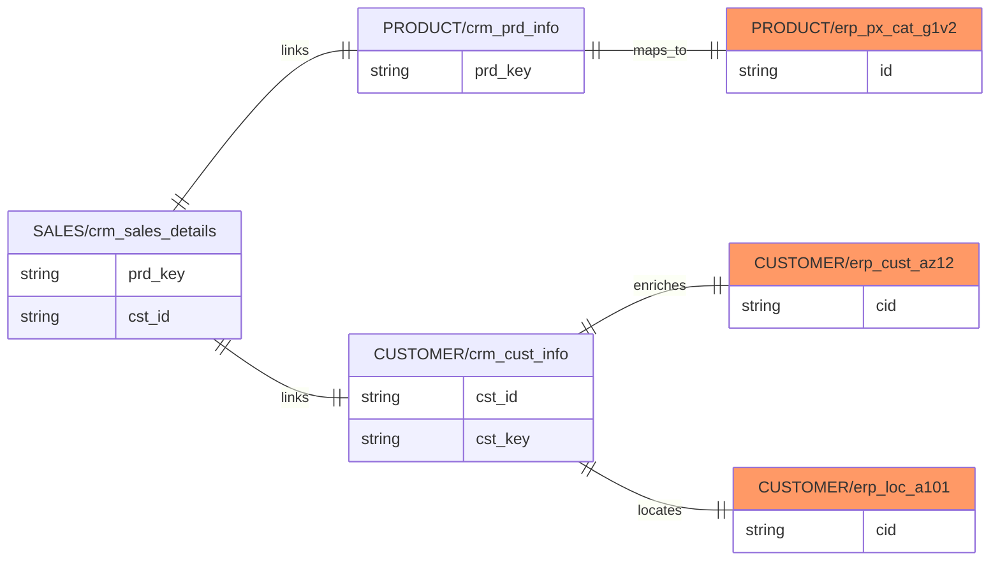

```mermaid
erDiagram
    direction LR

    "SALES/crm_sales_details" {
        string prd_key
        string cst_id
    }

    "PRODUCT/crm_prd_info" {
        string prd_key
    }

    "CUSTOMER/crm_cust_info" {
        string cst_id
        string cst_key
    }

    "PRODUCT/erp_px_cat_g1v2":::ERP {
        string id
    }

    "CUSTOMER/erp_cust_az12":::ERP {
        string cid
    }

    "CUSTOMER/erp_loc_a101":::ERP {
        string cid
    }

    "SALES/crm_sales_details" ||--|| "PRODUCT/crm_prd_info" : links
    "SALES/crm_sales_details" ||--|| "CUSTOMER/crm_cust_info" : links

    "PRODUCT/crm_prd_info" ||--|| "PRODUCT/erp_px_cat_g1v2" : maps_to

    "CUSTOMER/crm_cust_info" ||--|| "CUSTOMER/erp_cust_az12" : enriches
    "CUSTOMER/crm_cust_info" ||--|| "CUSTOMER/erp_loc_a101" : locates

    classDef ERP fill:#f96
```
