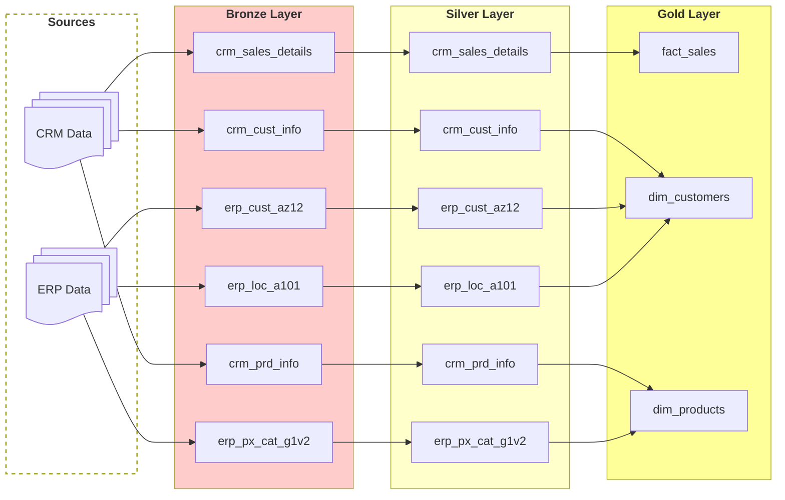

```mermaid
flowchart LR;
    subgraph LEVEL_SOURCES["<strong>Sources</strong>"]
        direction LR
        DATA_SOURCE_CRM@{ shape: docs, label: "CRM Data" }
        DATA_SOURCE_ERP@{ shape: docs, label: "ERP Data" }
    end

    subgraph LAYER_BRONZE["<strong>Bronze Layer</strong>"]
        direction LR
        DATA_RAW_CRM_SALES_DETAILS@{ shape: rect, label: "crm_sales_details" }
        DATA_RAW_CRM_CUST_INFO@{ shape: rect, label: "crm_cust_info" }
        DATA_RAW_CRM_PRD_INFO@{ shape: rect, label: "crm_prd_info" }
        DATA_RAW_ERP_CUST_AZ12@{ shape: rect, label: "erp_cust_az12" }
        DATA_RAW_ERP_LOC_A101@{ shape: rect, label: "erp_loc_a101" }
        DATA_RAW_ERP_PX_CAT_G1V2@{ shape: rect, label: "erp_px_cat_g1v2" }

    end

    subgraph LAYER_SILVER["<strong>Silver Layer</strong>"]
        direction LR
        DATA_CLEANED_STANDARDIZED_CRM_SALES_DETAILS@{ shape: rect, label: "crm_sales_details"}
        DATA_CLEANED_STANDARDIZED_CRM_CUST_INFO@{ shape: rect, label: "crm_cust_info"}
        DATA_CLEANED_STANDARDIZED_CRM_PRD_INFO@{ shape: rect, label: "crm_prd_info"}
        DATA_CLEANED_STANDARDIZED_ERP_CUST_AZ12@{ shape: rect, label: "erp_cust_az12"}
        DATA_CLEANED_STANDARDIZED_ERP_LOC_A101@{ shape: rect, label: "erp_loc_a101"}
        DATA_CLEANED_STANDARDIZED_ERP_PX_CAT_G1V2@{ shape: rect, label: "erp_px_cat_g1v2"}
    end

    subgraph LAYER_GOLD["<strong>Gold Layer</strong>"]
        direction LR
        DATA_BUSINESS_READY_FACT_SALES@{ shape: rect, label: "fact_sales"}
        DATA_BUSINESS_READY_DIM_CUSTOMERS@{ shape: rect, label: "dim_customers"}
        DATA_BUSINESS_READY_DIM_PRODUCTS@{ shape: rect, label: "dim_products"}
    end

    DATA_SOURCE_CRM --> DATA_RAW_CRM_SALES_DETAILS
    DATA_SOURCE_CRM --> DATA_RAW_CRM_CUST_INFO
    DATA_SOURCE_CRM --> DATA_RAW_CRM_PRD_INFO
    DATA_SOURCE_ERP --> DATA_RAW_ERP_CUST_AZ12
    DATA_SOURCE_ERP --> DATA_RAW_ERP_LOC_A101
    DATA_SOURCE_ERP --> DATA_RAW_ERP_PX_CAT_G1V2
    DATA_RAW_CRM_SALES_DETAILS --> DATA_CLEANED_STANDARDIZED_CRM_SALES_DETAILS
    DATA_RAW_CRM_CUST_INFO --> DATA_CLEANED_STANDARDIZED_CRM_CUST_INFO
    DATA_RAW_CRM_PRD_INFO --> DATA_CLEANED_STANDARDIZED_CRM_PRD_INFO
    DATA_RAW_ERP_CUST_AZ12 --> DATA_CLEANED_STANDARDIZED_ERP_CUST_AZ12
    DATA_RAW_ERP_LOC_A101 --> DATA_CLEANED_STANDARDIZED_ERP_LOC_A101
    DATA_RAW_ERP_PX_CAT_G1V2 --> DATA_CLEANED_STANDARDIZED_ERP_PX_CAT_G1V2
    DATA_CLEANED_STANDARDIZED_CRM_SALES_DETAILS --> DATA_BUSINESS_READY_FACT_SALES
    DATA_CLEANED_STANDARDIZED_CRM_CUST_INFO --> DATA_BUSINESS_READY_DIM_CUSTOMERS
    DATA_CLEANED_STANDARDIZED_CRM_PRD_INFO --> DATA_BUSINESS_READY_DIM_PRODUCTS
    DATA_CLEANED_STANDARDIZED_ERP_CUST_AZ12 --> DATA_BUSINESS_READY_DIM_CUSTOMERS
    DATA_CLEANED_STANDARDIZED_ERP_LOC_A101 --> DATA_BUSINESS_READY_DIM_CUSTOMERS
    DATA_CLEANED_STANDARDIZED_ERP_PX_CAT_G1V2 --> DATA_BUSINESS_READY_DIM_PRODUCTS;

    style LAYER_BRONZE fill:#ffcccc;
    style LAYER_SILVER fill:#ffffcc;
    style LAYER_GOLD fill:#ffff99;
    style LEVEL_SOURCES fill:#fff,stroke-width:2px,stroke-dasharray: 5 5

```
